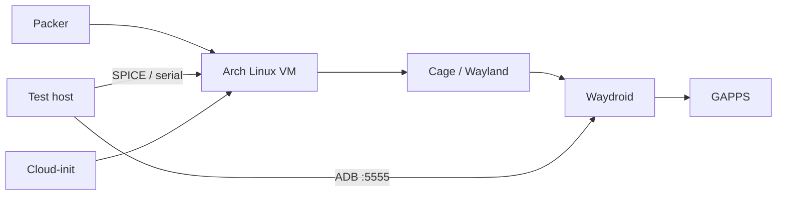

# Waydroid VM

```text
+--------------------------------------------------------------+
|                         WAYDROID VM                          |
|             Repeatable Arch Linux Android test labs          |
+--------------------------------------------------------------+
```

> **An Arch Linux appliance for repeatable Android testing — built with
> HashiCorp Packer.**

This repository builds a 32 GB Arch Linux VM containing [Waydroid], the
Android container runtime. The result is intended for disposable Android
application testing: boot the appliance, reach the Android UI through its
standalone Wayland session, and use ADB over TCP from the host or another
machine on the VM network.



Proxmox is the primary tested target. A local QEMU/KVM target is also
provided for development and validation.

## What is included

| Area | Implementation |
| --- | --- |
| Base system | Arch Linux, UK locale/keymap, systemd-networkd and SSH |
| Android | Waydroid initialised with the **GAPPS** image by default |
| GUI | Cage running a standalone Wayland/Waydroid full-screen session |
| Android tooling | `android-tools` on the host and ADB on TCP port `5555` |
| VM integration | QEMU guest agent and SPICE vdagent |
| Provisioning | Cloud-init and a generated Proxmox cloud-init drive |
| Optional app | The official Tailscale **Android APK** is installed inside Waydroid; Tailscale is not installed on the Arch host |

The builders request four vCPUs, 4 GiB RAM, and host CPU features. KVM and a
CPU capable of exposing the required virtualisation features are therefore
needed. On Proxmox, the template is created with `cpu_type = "host"`.

### Display Caveat

The Proxmox source deliberately uses the installer-safe VGA value `std` by
default. After the build, change the completed template's display to
`virtio-gl` in Proxmox before using the graphical appliance. This is a
manual post-build step for direct Packer builds; Packer does **not** make that
change automatically. The `mise run build:proxmox` task performs the change
through the Proxmox API after a successful build. For a direct Packer build,
find the generated template VM ID and run on the Proxmox node:

```sh
qm set <template-vmid> --vga virtio-gl,memory=64
```

The Proxmox source also provides a serial socket. `virtio-gl` exposes the
Proxmox SPICE console, and `spice-vdagent` is installed for clipboard, pointer,
and display integration.
The QEMU source is headless at the Packer level and supplies an installer
serial log; use ADB or your preferred QEMU display configuration when running
the resulting disk.

## Repository layout

```text
.
├── packer.pkr.hcl           # Shared provisioners and required plugins
├── proxmox_source.pkr.hcl   # Proxmox ISO builder and cloud-init drive
├── qemu_source.pkr.hcl      # Local QEMU/KVM ISO builder
├── variables.pkr.hcl        # Inputs and safe defaults where applicable
├── http/install-arch.sh     # Destructive, unattended Arch installer
├── mise.toml                # Reproducible Packer tasks
└── renovate.json            # Dependency update configuration
```

## Prerequisites and safety

* Linux with Packer, `curl`, and `jq`; for the QEMU target, working KVM access.
* A current Arch ISO matching the configured checksum. QEMU downloads the
  default `2026.07.01` ISO mirror URL from `variables.pkr.hcl`.
* For Proxmox, API access, a node, storage pools, and a VM network bridge.
* A laptop or build host address reachable **from the installing VM**. The
  Proxmox builder serves `install-arch.sh` from `proxmox_http_ip` on the fixed
  port `proxmox_http_port` (default `8888`). Permit that TCP connection in the
  laptop firewall and any network firewall between the laptop and Proxmox;
  binding the server to an address that Proxmox cannot route to will make the
  installer fail.

The installer wipes the first disk reported by `lsblk` and replaces its
partition table. Never point it at a VM containing data. Test in an isolated
network where appropriate. The checked-in default SSH password is intended
only for the build handshake: do not reuse it for a deployed appliance.
Supply sensitive values through environment variables or a local, untracked
variables file, and rotate credentials after testing.

Install Packer directly or use [mise]:

```sh
mise install
```

The repository also exposes the common checks and builds as mise tasks:

```sh
mise run fmt
mise run validate-qemu
mise run validate-proxmox
mise run build-qemu
mise run build-proxmox
```

The Proxmox validation and build tasks require the `PKR_VAR_proxmox_*`
credentials, ISO, and HTTP-address variables described below.

## Proxmox Preparation

> [!IMPORTANT]
> The Arch ISO must already exist on Proxmox storage. Packer does not upload
> the ISO during the Proxmox build.

The Proxmox builder expects the ISO to already exist on Proxmox storage; it
does not upload the local ISO. Upload it through the Proxmox UI or download it
on the Proxmox host, then use the storage-relative path. For example, the
requested filename/path pattern could be represented safely as:

```text
<proxmox-storage-name>:iso/archlinux-2026.07.01-x86_64.iso
```

In one environment that value might be
`gondor-iso:iso/archlinux-2026.07.01-x86_64.iso`; storage names are
environment-specific and this repository does not make that value a default.
Pass the actual value as `proxmox_iso_file` (for example through
`PROXMOX_ISO_FILE` below). Confirm that the selected node can read the ISO and
that the chosen disk and cloud-init storage pools exist.

## Build with QEMU/KVM

The QEMU builder uses the Arch mirror URL and checksum in
`variables.pkr.hcl` by default:

```sh
packer init .
packer fmt -check .
packer validate -only=qemu.waydroid_qemu .
packer build -only=qemu.waydroid_qemu .
```

To use a proxy for Arch and Tailscale downloads, pass a URL explicitly. An
empty value means no proxy:

```sh
PKR_VAR_http_proxy="http://<proxy-host>:<port>" \
  packer build -only=qemu.waydroid_qemu .
```

The output disk is written below `output-waydroid-qemu/`.

## Build with Proxmox

Set the required values in the environment. The `PKR_VAR_` prefix is Packer's
environment-variable mechanism; values are read without putting secrets in
the command line or repository. Keep the token secret in a shell variable,
secret manager, or CI secret — do not paste it into this document or commit it.

```sh
export PKR_VAR_proxmox_api_url="https://<proxmox-host>:8006/api2/json"
export PKR_VAR_proxmox_node="<proxmox-node>"
export PKR_VAR_proxmox_api_token_id="<token-id>"
export PKR_VAR_proxmox_api_token_secret="<token-secret>"
export PKR_VAR_proxmox_http_ip="<laptop-reachable-address>"
export PKR_VAR_proxmox_iso_file="<proxmox-storage-name>:iso/archlinux-2026.07.01-x86_64.iso"
export PKR_VAR_proxmox_cloud_init_storage_pool="<cloud-init-storage-name>"
export PROXMOX_TEMPLATE_NAME="archlinux-waydroid-golden"

packer init .
packer validate -only=proxmox-iso.waydroid_proxmox .
packer build -only=proxmox-iso.waydroid_proxmox .
```

For the complete build-and-configure workflow, use:

```sh
mise run build:proxmox
```

That task builds the template and then changes its display to `virtio-gl`
through the Proxmox API.

If the token is supplied by another environment variable, assign it with
quotes rather than embedding it in an unquoted command. This avoids shell
expansion and history surprises:

```sh
export PROXMOX_TOKEN_SECRET_FROM_SECRET_STORE='<read-from-your-secret-store>'
export PKR_VAR_proxmox_api_token_secret="$PROXMOX_TOKEN_SECRET_FROM_SECRET_STORE"
```

Do not use `set -x` while exporting or building with secrets in scope.
`proxmox_http_ip` is the address where Packer binds its HTTP server, not
necessarily the Proxmox node address. The VM must be able to fetch
`http://<proxmox_http_ip>:8888/install-arch.sh` during installation.

The default Proxmox storage and node values can be overridden with the
corresponding `PKR_VAR_...` variables. The build creates a template with a
cloud-init drive, host CPU features, a serial socket, and installer VGA. The
cloud-init drive is stored in `proxmox_cloud_init_storage_pool`, which defaults
to `local`; override it if that storage cannot hold cloud-init drives. Once the
build is complete, switch its display to `virtio-gl` using the command above.

## First Boot and Daily Testing

1. In Proxmox, configure cloud-init user data for the first boot. Use the
   existing `arch` account, set a unique password and/or add an SSH public key.
   Cloud-init is enabled with the `NoCloud` and `ConfigDrive` data sources, and
   SSH password authentication is enabled by the image.
2. Start the VM and wait for networking and the Cage/Waydroid kiosk service.
   Use the Proxmox serial socket for low-level diagnosis.
3. Open the graphical console through Proxmox SPICE after changing the display
   to `virtio-gl`. Proxmox's **Console > SPICE** action downloads a `.vv` file;
   open it with:

   ```sh
   remote-viewer <downloaded-file>.vv
   ```

   The SPICE proxy ticket is short-lived, so generate a fresh `.vv` file when
   connecting. Proxmox marks the file with `delete-this-file=1`, and
   `remote-viewer` deletes it after opening by design. If you need to retain a
   diagnostic copy, duplicate it before opening and change that flag to `0`;
   do not share the file because it contains a temporary SPICE credential.
4. Find the VM's address from the Proxmox console or DHCP lease, then connect
   ADB from a test machine:

   ```sh
   adb connect <vm-address>:5555
   adb devices
   ```

   Restrict TCP/5555 to a trusted test network. The appliance enables ADB in
   Waydroid; it is not an Android device-management security boundary.
5. Install and exercise the Android application under test. The Tailscale APK
   is an Android application inside Waydroid, so Android permissions, VPN
   behaviour, kernel support, and Waydroid networking can affect it. It does
   not provide Tailscale connectivity for the Arch host. The APK is installed
   during provisioning, but it is not authenticated to a tailnet; complete the
   Tailscale Android sign-in or auth-key flow after first boot.

## Validation and Troubleshooting

```sh
packer fmt -check .
packer validate -only=qemu.waydroid_qemu .
packer validate -only=proxmox-iso.waydroid_proxmox .
```

* **Installer cannot fetch the script:** check `proxmox_http_ip`, port `8888`,
  routing, and laptop/firewall rules. The script is served by Packer, not by
  Proxmox storage.
* **ISO not found on Proxmox:** verify the complete storage-relative
  `proxmox_iso_file` value and that the ISO is on the selected node/storage.
* **Waydroid has no network:** inspect the virtio NIC, DHCP, DNS, and the
  `waydroid-container.service` journal.
* **No graphical output:** confirm the post-build Proxmox display is
  `virtio-gl`, that the VM has a suitable console, and that
  `waydroid-kiosk.service` is running. The build-time `std` VGA is intentional.
* **Downloads fail behind a proxy:** set `PKR_VAR_http_proxy` to the complete
  proxy URL, for example `http://<proxy-host>:3128`, and rebuild.
* **GAPPS initialisation fails:** check outbound HTTPS access from the build
  environment and review the installer output before retrying with a clean VM.

## Cleanup

After testing, remove the generated QEMU output directory and destroy or
remove the temporary/template VM from Proxmox according to your retention
policy. Also revoke short-lived API tokens and delete any copied ISO or local
logs that contain sensitive operational details. This repository intentionally
does not stage ISO images, scratch tools, tokens, or credentials.

[Waydroid]: https://waydro.id/
[mise]: https://mise.jdx.dev/
